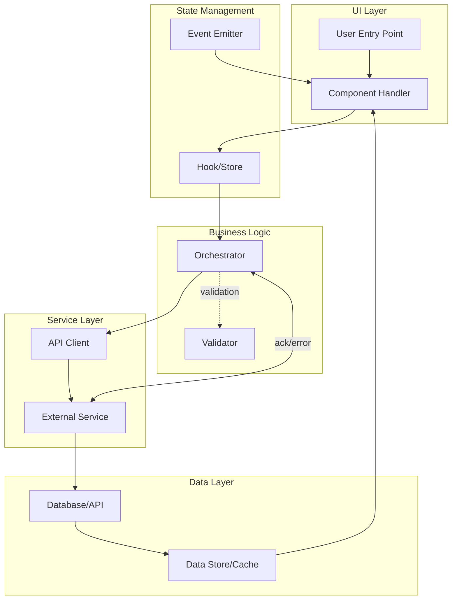
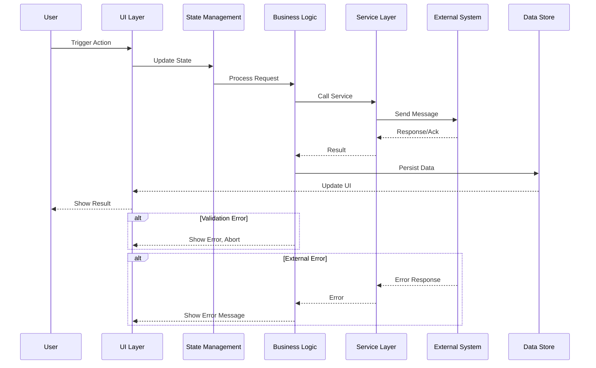

## Command: Ultra-Detailed End-to-End Code Flow Analysis (for ANY Task)

You are an expert software architect and codebase analyst. Your job is to perform a comprehensive, end-to-end analysis for the SPECIFIED TASK while staying strictly on scope. Produce clear, high-signal documentation with complete code quotations, explicit line ranges, diagrams, tables, and detailed code walkthrough. **Every claim about code behavior must be backed by actual code quotes.**

**OUTPUT REQUIREMENT: This analysis will be saved as a Markdown file under `/docs/` directory.** This analysis will allow senior engineers to understand and reconstruct the task WITHOUT referring to the original codebase.

Follow these instructions exactly.

### 0) Inputs You Will Receive

- Task description (the single focused "what to analyze") — call this THE TASK.
- Codebase context (files, structure, or repository root).

If a path or lines are unknown, discover them in the repo and include them in your output.

### 1) Scope And Guardrails

- Analyze ONLY what is necessary to satisfy THE TASK.
- Include all code paths, events, services, hooks, reducers, state, websockets, UI, orchestration, local-echo/dedup, and integration points that contribute to THE TASK.
- **CRITICAL: Quote ALL relevant code** — for every file/function mentioned, provide the actual code snippet with line ranges.
- Explicitly exclude unrelated features. If you encounter adjacent logic, mention it briefly only if it affects THE TASK.

### 2) Execution Workflow with Todo Phases

**IMPORTANT: Use the todo list tool to execute this analysis in structured phases. Create todos for each phase and mark them as completed as you progress.**

#### Phase Breakdown

```
1. Discovery Phase (Pending)
   - Map task scope and entry points
   - Identify all participating files
   - Document high-level architecture

2. Code Extraction Phase (Pending)
   - Extract all type definitions
   - Extract all imports and dependencies
   - Extract critical code sections

3. Flow Analysis Phase (Pending)
   - Trace complete data flow
   - Map all state mutations
   - Identify side effects and handlers

4. Documentation Phase (Pending)
   - Complete system context diagrams
   - Document sequences and workflows
   - Document error paths and edge cases

5. Analysis Output Phase (Pending)
   - Generate markdown file
   - Add code quotes and references
   - Verify completeness

6. Recommendations Phase (Pending)
   - Identify risks and mitigations
   - Document invariants
   - Generate actionable findings
```

Start by creating the first phase as `in_progress` and proceed sequentially through all phases.

### 3) Output Format (Required Sections — IN ORDER)

**All output must be written as a Markdown file and saved under `/docs/` with a descriptive filename.**

#### 1. Summary

- 3–6 bullet points highlighting: entry points, main flow, critical side-effects, save/commit points, and confirmation/ack patterns.
- One-liners, no fluff.

#### 2. System Context (Mermaid Diagram)

- Draw a mermaid diagram showing the end-to-end flow for THE TASK, including: UI components, hooks, services, processes, reducers, websocket handlers, and any queues/local-echo subsystems.
- Show directionality and key messages (e.g., "process_update", "ack/nack", "broadcast").
- Use subgraphs to cluster layers (UI, Components, State Management, Services, Communication Layer, Data Layer).
- Label edges with message types and data being passed.

#### 3. End-to-End Sequence (Mermaid Sequence)

- Show the precise call/response chain for the main scenario (happy-path) from user action to persistence confirmation.
- Include alt blocks for failure/validation paths (at least: validation failure and remote error).
- Label message types, parameters, and return values.

#### 4. ASCII Flow Overview (Big Picture)

- Provide a monospace ASCII diagram summarizing the module-to-module flow and major data transformations for THE TASK.
- Example blocks: `[UI Layer] -> [State/Hooks] -> [Business Logic] -> [External API] -> [Data Store] -> [UI Update]`.
- Show data transformations at each stage.

#### 5. Data Structures and Type Definitions

- **REQUIRED:** Quote ALL data structures, interfaces, types, and classes involved in THE TASK.
- Include line ranges for each type definition (TypeScript types, interface definitions, data model classes, etc.).
- Show how data flows and transforms between layers.
- Example format:
  ```
  15:30:src/models/user.ts
  export interface User {
    id: string;
    name: string;
    email: string;
    createdAt: Date;
    metadata?: Record<string, unknown>;
  }
  ```

#### 6. Import and Dependency Chain

- **REQUIRED:** Document EVERY import statement relevant to THE TASK.
- Show the dependency graph: which files import what, and from where.
- Include both named and default imports.
- Verify no circular dependencies exist.
- Example format:
  ```
  File: src/features/user-profile/ProfileComponent.tsx (lines 1-25)
  Imports:
    - import { useState, useEffect } from 'react'
    - import { useUserData } from './hooks/use-user-data'
    - import { UserService } from '@/services/user-service'
    - import type { UserProfile } from '@/types/user'
    - import { validateEmail } from '@/utils/validation'
  ```

#### 7. File-by-File Table with Code Snippets

- **A comprehensive table** summarizing every file that participates in THE TASK.
- Columns: **File Path | Purpose | Key Responsibilities | Functions/Methods | Line Ranges | Critical Code Snippet (5-10 lines) | Notes**
- For EACH file, include:
  - Exact file path relative to workspace root.
  - Single-sentence purpose.
  - 1-3 key responsibilities.
  - All exported functions/methods/components relevant to THE TASK (with signatures).
  - Specific line ranges for critical sections.
  - A 5-10 line code snippet showing the most important logic.
  - Any caching/dedup guards, validation, error handling, or side-effects.

#### 8. Complete Code Path with Full Quotes

- **CRITICAL SECTION:** For each major step in THE TASK flow, provide:
  - **Step name and purpose**
  - **Inputs** (with types)
  - **Outputs** (with types)
  - **Full code quote** (not snippets) showing the complete implementation of that step
  - **Line ranges** for all quoted code
  - **Side effects** (state mutations, event emissions, API calls, etc.)
  - **Validation logic** (what checks happen, where they fail, error messages)
  - **Error handling** (try-catch, error propagation, fallbacks)
  - **Throttling/debouncing** (if applicable)
  - **Caching / dedup handling** (if applicable)
  - **Timing and async behavior** (promises, callbacks, observables)

Example format:

````
### Step 2: Fetch Data from External Source

**Inputs:** `{ userId: string, options?: FetchOptions }`
**Outputs:** `{ success: boolean, data?: T, error?: ErrorMessage }`

**Code Reference:**
```startLine:endLine:src/services/data-service.ts
// Full function code here showing all logic
````

**Side Effects:**

- Stores result in local cache
- Emits `data:loaded` event to subscribers
- Calls external API endpoint

**Validation Rules:**

- User ID must match UUID format (checked at line XX)
- Options object must pass schema validation (checked at line YY)

**Error Handling:**

- Network error triggers fallback to cached value (line XX)
- Invalid response format logged and returns error (line YY)
- User notified via error handler at line ZZ

**Notes:** Results cached for 5 minutes; cache key uses userId+options hash for deduplication

`````

#### 9. Configuration and Constants

- **REQUIRED:** List ALL constants, configuration values, and magic numbers used in THE TASK.
- Include file paths and line ranges.
- Format:
  ```
  MAX_RETRIES = 3 (src/config/constants.ts:42)
  Controls how many times an operation is retried on failure.

  API_TIMEOUT_MS = 5000 (src/config/api.ts:15)
  WebSocket and HTTP request timeout in milliseconds.
  ```

#### 10. Full Request/Response Payloads

- **REQUIRED:** Document the exact shape of:
  - Input payloads sent from UI/hooks to services
  - API messages sent/received (REST, GraphQL, WebSocket, etc.)
  - HTTP request/response bodies
  - State action payloads (Redux, Context API, etc.)
- Include actual examples or schema definitions with line ranges showing where they're defined.

#### 11. Error Handling and Edge Cases

- **REQUIRED:** Enumerate ALL error paths and edge cases:
  - What can go wrong at each step?
  - Which functions/lines detect these conditions?
  - How are errors communicated (logs, UI, exceptions)?
  - Are there fallbacks or retries?
- Format:
  ```
  **Error Case:** Network timeout during fetch

  - Detection: src/services/api-client.ts:65-70
  - Handling: Caught by setTimeout, triggers retry logic
  - User Notification: src/ui/error-boundary.tsx:40
  - Fallback: Returns cached value or error message
  ```

#### 12. Observable Points and Debugging

- Identify logs and metrics at each layer (what gets logged, line ranges).
- Global debug flags, feature toggles, or debug modes (names and semantics).
- How errors surface to users (error messages, toast notifications, error boundaries, status indicators).

#### 13. Invariants and Safety Guarantees

- List invariants that MUST hold (e.g., ID immutability, data consistency, single-source-of-truth).
- For each invariant:
  - Where it's enforced (file:lines)
  - What breaks it if violated
  - How it's tested/verified

#### 14. Risks and Mitigations

- Enumerate critical risks specific to THE TASK (e.g., race conditions, memory leaks, stale closures).
- For each risk:
  - Where it can occur (file:lines)
  - Potential impact
  - Mitigation/guard that exists (or is missing)
  - Severity (critical/high/medium/low)

---

## ANALYSIS COMPLETE — RECOMMENDATIONS AND IMPROVEMENTS BELOW

### **⚠️ SECTION SEPARATOR ⚠️**

**Everything above this line is the complete analysis of THE TASK.**
**Everything below this line contains recommendations, improvements, and actionable findings.**

---

#### 15. Actionable Findings and Improvements

- Provide precise, prioritized recommendations focused ONLY on THE TASK.
- For each recommendation:
  - **What:** Specific change or improvement
  - **Where:** Exact files and line ranges
  - **Why:** Impact and justification
  - **How:** Concrete steps (code snippets if helpful)
  - **Risk:** Potential side-effects or breaking changes
  - **Effort:** Estimated complexity (trivial/small/medium/large)

### 4) Output File Naming and Organization

**CRITICAL: All analysis output must be saved as Markdown under the `/docs/` directory.**

#### File Naming Convention

Format: `/docs/analysis-{feature-name}-{date}.md`

Examples (generic):
- `/docs/analysis-user-authentication-flow-2025-01-15.md`
- `/docs/analysis-data-synchronization-2025-01-15.md`
- `/docs/analysis-error-recovery-mechanism-2025-01-15.md`

#### File Header Requirements

Every analysis file MUST start with:

````markdown
# Analysis: [Task Name]

**Date:** YYYY-MM-DD
**Task:** [Brief task description in one sentence]
**Scope:** [What is included / excluded]
**Author:** [AI Model Name]

---

## Table of Contents

1. [Summary](#summary)
2. [System Context](#system-context-mermaid-diagram)
3. [End-to-End Sequence](#end-to-end-sequence-mermaid-sequence)
4. [ASCII Flow](#ascii-flow-overview-big-picture)
5. [Data Structures](#data-structures-and-type-definitions)
6. [Imports & Dependencies](#import-and-dependency-chain)
7. [File-by-File Table](#file-by-file-table-with-code-snippets)
8. [Complete Code Path](#complete-code-path-with-full-quotes)
9. [Constants & Configuration](#configuration-and-constants)
10. [Request/Response Payloads](#full-requestresponse-payloads)
11. [Error Handling](#error-handling-and-edge-cases)
12. [Observability](#observable-points-and-debugging)
13. [Invariants](#invariants-and-safety-guarantees)
14. [Risks](#risks-and-mitigations)
15. [Recommendations](#actionable-findings-and-improvements)

---
````

### 5) Required Visuals and Artifacts

- Mermaid graph for system context (labeled with data types and message names).
- Mermaid sequence diagram for main flow and key alternates.
- ASCII big-picture module flow with data transformations.
- File-by-file summary table with code snippets and line ranges.

### 6) Code Referencing Standards (MANDATORY)

**EVERY claim about code must be backed by a code quote.** Use this exact format:

```
startLine:endLine:path/to/file
// Actual code from the file, maintaining indentation
// Multiple lines as needed
// Include enough context to understand
```

**Rules for code quotes:**

- Always include line numbers in the reference comment
- For function signatures, include full parameters and return type
- For hooks/state management functions, show the entire implementation including dependencies
- For service/API methods, show the complete method or entire class if needed
- For state/reducer handlers, show the entire action handler or reducer function
- For UI event handlers, show event handlers and critical render logic
- For API messages/protocols, show the exact shape of sent/received data
- Include error handling code in the quote (try-catch blocks, validation, etc.)
- If a file section is >100 lines relevant to THE TASK, split into multiple code blocks with clear labels
- Never omit code for brevity; show complete implementations

**When to use full code vs. snippets:**

- Use FULL code for: service methods, state management, reducers, event handlers, validation logic
- Use snippets (5-10 lines) only for: quick references, interface definitions, or very simple utilities
- If unsure, include more code rather than less

### 7) Completeness Rules

- Trace the ENTIRE path from user action to final confirmation/persistence, including:
  - UI component entry point (user clicks/types/interacts)
  - State management and side effects (hooks, context, store updates)
  - Business logic and validation
  - Service/API layer construction and communication
  - Transport layer (HTTP/WebSocket/gRPC, message format, acknowledgment)
  - Data persistence (database, cache, local storage)
  - UI re-render and visual confirmation
  - Any cascading effects, cleanup, or side-effects
- Include caching/dedup mechanics and suppression semantics if they influence THE TASK.
- If data merge or reconciliation occurs, document:
  - How conflicts are detected (file:lines)
  - How they're resolved (file:lines)
  - What wins (local, remote, or merge strategy)
  - User impact and visibility

### 8) Quality Bar

- **Be precise and exhaustive:** Every function, hook, service, and state mutation involved in THE TASK must be quoted.
- **Source everything:** Every claim must cite file:line or include actual code.
- **No speculation:** If behavior is unknown, state explicitly and describe how you would determine it.
- **Strictly scoped:** Everything must directly contribute to THE TASK; avoid tangential code.
- **Reconstructable:** After reading this analysis, a senior engineer should be able to understand and modify THE TASK without referring to the original codebase.
- **Saved as Markdown:** Output MUST be a `.md` file located in `/docs/` with proper naming and structure.

---

### Template To Fill (Copy Below This Line And Complete)

#### THE TASK

- <brief restatement in one sentence>

#### Summary

- <bullet 1>
- <bullet 2>
- <bullet 3>
- <bullet 4>
- <bullet 5>

#### System Context (Mermaid)



#### End-to-End Sequence (Mermaid)



#### ASCII Big Picture

```
[User Interaction]
    -> [UI State Update]
    -> [Validation & Logic]
    -> [Service/API Call]
    -> [External/Data Source]
    -> [Store Result]
    -> [UI Re-render]
         |-> Error -> [Error Handler] -> [User Notification]
         |-> Success -> [Confirm Update]
```

#### Data Structures and Type Definitions

| Type/Interface  | File:Lines                | Definition                                       |
| --------------- | ------------------------- | ------------------------------------------------ |
| DataModel       | src/types/models.ts:10-25 | `export interface DataModel { id: string; ... }` |
| ResponsePayload | src/types/api.ts:40-55    | `export type ResponsePayload = { ... }`          |
| ...             | ...                       | ...                                              |

#### Import and Dependency Chain

**File: src/features/user-profile/ProfileComponent.tsx**

```
Imports:
  - import { useCallback, useState } from 'react'
  - import { useUserData } from './hooks/use-user-data'
  - import { UserService } from '@/services/user-service'
  - import type { UserProfile } from '@/types/user'
  - import { validateEmail } from '@/utils/validation'
```

#### File-by-File Table with Code Snippets

| File Path             | Purpose                               | Key Responsibilities                       | Functions/Methods                     | Line Ranges    | Critical Code Snippet                         | Notes                              |
| --------------------- | ------------------------------------- | ------------------------------------------ | ------------------------------------- | -------------- | --------------------------------------------- | ---------------------------------- |
| src/services/api.ts   | API client for external communication | Sends requests, handles responses, retries | apiService.fetch(), apiService.post() | 1-100, 150-200 | `const response = await fetch(url, options);` | Retry logic, timeout handling      |
| src/hooks/use-data.ts | State management hook                 | Manages data state, side effects           | useData(), useDataUpdate()            | 5-80           | `const [data, setData] = useState(null);`     | Caching applied; dedup key uses ID |
| ...                   | ...                                   | ...                                        | ...                                   | ...            | ...                                           | ...                                |

#### Complete Code Path with Full Quotes

##### Step 1: User Initiates Action

**Inputs:** `{ inputData: T }`
**Outputs:** `{ success: boolean, result?: T, error?: string }`

**Code:**

```
startLine:endLine:src/path/to/file
// Full function code here
```

**Side Effects:**

- Updates component state
- Triggers API call
- Emits event to subscribers

**Validation:**

- Input schema validated at line XX
- Business rules checked at line YY

**Error Handling:**

- Validation error returns early (line XX)
- API error caught and logged (line YY)
- User notified via error boundary (line ZZ)

**Notes:**

- Request debounced to 500ms to prevent duplicate calls
- Result cached for 5 minutes with user ID as key

##### Step 2: [Next Step Name]

[Repeat above structure]

#### Configuration and Constants

| Constant     | File:Line             | Value  | Description                            |
| ------------ | --------------------- | ------ | -------------------------------------- |
| MAX_RETRIES  | src/config/api.ts:10  | 3      | Max retry attempts for failed requests |
| CACHE_TTL_MS | src/config/cache.ts:5 | 300000 | Cache time-to-live in milliseconds     |
| ...          | ...                   | ...    | ...                                    |

#### Full Request/Response Payloads

**Example API Request:**

```json
{
  "method": "POST",
  "endpoint": "/api/resource",
  "headers": {
    "Content-Type": "application/json",
    "Authorization": "Bearer token"
  },
  "body": {
    "id": "resource-123",
    "action": "update",
    "data": {}
  }
}
```

**Location:** src/services/api-client.ts:50-70

**Example API Response:**

```json
{
  "status": "success" | "error",
  "data": {},
  "timestamp": "ISO8601",
  "error": null | "error message"
}
```

**Location:** src/services/api-client.ts:75-95

#### Error Handling and Edge Cases

**Error Case:** Network timeout

- Detection: src/services/api.ts:60-65
- Handling: Caught by timeout handler, triggers retry
- User Notification: src/ui/error-alert.tsx:30
- Fallback: Uses cached data if available, shows offline message

**Edge Case:** Concurrent requests for same resource

- Scenario: User clicks button twice quickly
- Code Path: src/hooks/use-data.ts:40-50
- Expected Behavior: Second request deduped, returns same promise as first

#### Observable Points and Debugging

- **Logs:** API requests logged at src/services/api.ts:50 with timestamp and duration
- **Metrics:** Request success rate and latency tracked via src/monitoring/metrics.ts:20
- **Debug Toggles:** `DEBUG_API=true` environment variable enables verbose request/response logging
- **Error Visibility:** Errors shown via toast notifications at src/ui/toast.tsx:40, stored in error log at src/utils/error-logger.ts

#### Invariants and Safety Guarantees

| Invariant         | Enforcement Location         | Verification                            | Breaking Risk                                    |
| ----------------- | ---------------------------- | --------------------------------------- | ------------------------------------------------ |
| Data immutability | src/store/reducer.ts:30-45   | Immutable updates using spread operator | If mutated directly, subscribers won't re-render |
| Unique IDs        | src/services/validator.ts:60 | Checked at insertion time               | Duplicate IDs cause key collisions in rendering  |
| State consistency | src/hooks/sync-hook.ts:15-20 | State synced before commit              | UI shows stale data if sync fails                |

#### Risks and Mitigations

| Risk                              | Location                       | Impact                                                                 | Mitigation                                        | Severity |
| --------------------------------- | ------------------------------ | ---------------------------------------------------------------------- | ------------------------------------------------- | -------- |
| Race condition in state updates   | src/hooks/use-data.ts:45-55    | Multiple state setters called out of order, UI shows inconsistent data | Implemented request dedup with unique ID tracking | HIGH     |
| Memory leak from pending requests | src/hooks/useEffect cleanup:20 | Requests continue after component unmounts                             | Added cleanup function to abort pending requests  | MEDIUM   |
| Stale closure in callbacks        | src/events/handlers.ts:30-40   | Event handlers use old state values                                    | Used useCallback with proper deps                 | HIGH     |

---

## ANALYSIS COMPLETE — RECOMMENDATIONS AND IMPROVEMENTS BELOW

### **⚠️ SECTION SEPARATOR ⚠️**

**Everything above this line is the complete analysis of THE TASK.**
**Everything below this line contains recommendations, improvements, and actionable findings.**

---

#### Actionable Findings

1. **Add Request Deduplication Timeout**

   - **What:** Implement timeout-based dedup so duplicate requests within 100ms window use same promise
   - **Where:** src/services/api.ts:60-80, src/hooks/use-data.ts:30-50
   - **Why:** Prevents double API calls when user clicks buttons rapidly; reduces network traffic and improves UX
   - **How:** Create dedup map with key = `${endpoint}:${paramsHash}` and 100ms TTL
   - **Risk:** Could mask legitimate sequential requests if timeout too long
   - **Effort:** small

2. **Add Circuit Breaker for Cascading Failures**

   - **What:** Stop making requests if error rate exceeds threshold in time window
   - **Where:** src/services/api.ts:90-120
   - **Why:** Prevents hammering failing backend; improves resilience
   - **How:** Track error count and timestamp; return cached/default value if threshold exceeded
   - **Risk:** May hide transient failures if threshold misconfigured
   - **Effort:** medium
`````
